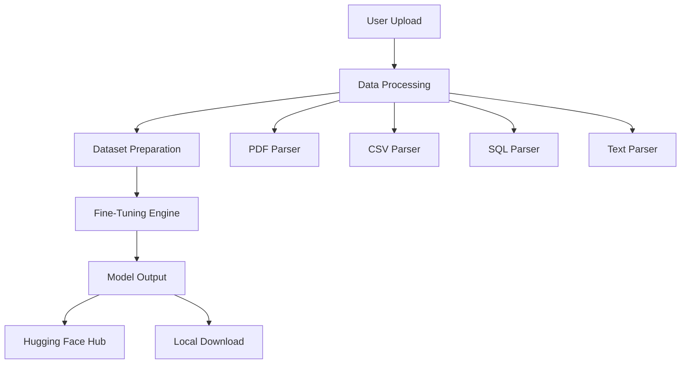

# Custom LLM Fine-Tuning System

[](LICENSE)
[](https://python.org)
[](https://streamlit.io)
[](https://huggingface.co)
[](https://ai.meta.com/llama/)

> **Custom LLM Fine-Tuning System** - An open-source, user-friendly web-based system that enables anyone to fine-tune large language models like Llama 3 using custom data. Upload PDFs, CSVs, SQL files, or text documents and get a customized model ready for deployment.

## 🚀 Project Overview

The Custom LLM Fine-Tuning System democratizes AI customization by providing a "one-click" fine-tuning solution. Users can upload files in various formats (text, PDF, CSV, SQL), and the system automatically handles data extraction, dataset preparation, fine-tuning, and outputs a customized model ready for deployment via Hugging Face Hub or local download.

### 🎯 Key Objectives

- ✅ **Democratize AI Customization** - Make fine-tuning accessible to non-experts
- ✅ **Multi-Format Data Support** - Handle PDFs, CSVs, SQL files, and text documents
- ✅ **Efficient Training** - Use LoRA/QLoRA for low-resource training
- ✅ **Privacy-Focused** - Local processing options for sensitive data
- ✅ **Global Accessibility** - Deployable on free platforms like Google Colab
- ✅ **Open Source** - Transparent, community-driven development

## 🎯 Target Audience

- **Writers** - Fine-tune on personal essays for style imitation
- **Businesses** - Tune on customer CSVs for sentiment analysis
- **Researchers** - Process SQL dumps or PDFs for domain-specific Q&A
- **Educators** - Customize on textbooks for interactive tutors
- **Developers** - Create specialized models for specific use cases

## ✨ Key Features

### 1. Multi-Format Data Ingestion

#### Supported File Types
```python
# Data ingestion pipeline
supported_formats = {
    'text': ['.txt', '.md', '.json'],
    'pdf': ['.pdf'],
    'csv': ['.csv'],
    'sql': ['.sql', '.db']
}

def parse_file(file_path):
    """Parse different file formats into training data"""
    if file_path.endswith('.pdf'):
        return parse_pdf(file_path)
    elif file_path.endswith('.csv'):
        return parse_csv(file_path)
    elif file_path.endswith('.sql'):
        return parse_sql(file_path)
    else:
        return parse_text(file_path)
```

**Capabilities:**
- **PDF Processing** - Extract text and tables using LlamaParse
- **CSV Handling** - Convert tabular data to prompt-response pairs
- **SQL Processing** - Parse queries and schemas for Q&A training
- **Text Documents** - Direct processing of markdown and JSON files

#### Data Processing Pipeline
```python
# Automated dataset preparation
def create_training_dataset(files):
    """Convert uploaded files to Hugging Face dataset"""
    data = []
    for file in files:
        parsed_data = parse_file(file)
        formatted_data = format_for_training(parsed_data)
        data.extend(formatted_data)
    
    return Dataset.from_list(data)
```

### 2. Efficient Fine-Tuning Engine

#### LoRA/QLoRA Implementation
```python
# Efficient fine-tuning with Unsloth
from unsloth import FastLanguageModel
from peft import LoraConfig

def setup_fine_tuning(model_name="meta-llama/Llama-3-8B"):
    """Configure efficient fine-tuning"""
    model, tokenizer = FastLanguageModel.from_pretrained(
        model_name,
        max_seq_length=2048,
        dtype=None,
        load_in_4bit=True
    )
    
    # Configure LoRA
    model = FastLanguageModel.get_peft_model(
        model,
        r=16,
        target_modules=["q_proj", "k_proj", "v_proj", "o_proj"],
        lora_alpha=16,
        lora_dropout=0,
        bias="none",
        use_gradient_checkpointing="unsloth",
        random_state=3407,
        use_rslora=False,
        loftq_config=None
    )
    
    return model, tokenizer
```

#### Training Configuration
```python
# Optimized training parameters
training_config = {
    "learning_rate": 2e-4,
    "num_train_epochs": 3,
    "warmup_ratio": 0.03,
    "per_device_train_batch_size": 2,
    "gradient_accumulation_steps": 4,
    "optim": "adamw_8bit",
    "save_steps": 500,
    "logging_steps": 10,
    "evaluation_strategy": "steps",
    "eval_steps": 500,
    "save_total_limit": 3,
    "load_best_model_at_end": True,
    "metric_for_best_model": "eval_loss"
}
```

### 3. User-Friendly Web Interface

#### Streamlit Dashboard
```python
# Main application interface
import streamlit as st

def main():
    st.title("Custom LLM Fine-Tuning System")
    
    # File upload section
    uploaded_files = st.file_uploader(
        "Upload your data files",
        accept_multiple_files=True,
        type=['txt', 'pdf', 'csv', 'sql', 'md', 'json']
    )
    
    # Model selection
    model_options = {
        "Llama 3 8B": "meta-llama/Llama-3-8B",
        "Llama 3 70B": "meta-llama/Llama-3-70B"
    }
    selected_model = st.selectbox("Choose base model", list(model_options.keys()))
    
    # Training parameters
    epochs = st.slider("Training epochs", 1, 10, 3)
    learning_rate = st.selectbox("Learning rate", [1e-4, 2e-4, 5e-4], index=1)
    
    if st.button("Start Fine-Tuning"):
        start_training(uploaded_files, model_options[selected_model], epochs, learning_rate)
```

#### Real-Time Progress Tracking
```python
# Progress monitoring
def display_training_progress(job_id):
    """Show real-time training progress"""
    progress_bar = st.progress(0)
    status_text = st.empty()
    
    while True:
        status = get_training_status(job_id)
        progress = status['progress']
        
        progress_bar.progress(progress)
        status_text.text(f"Training: {progress}% - {status['current_step']}/{status['total_steps']}")
        
        if status['completed']:
            st.success("Training completed!")
            break
        
        time.sleep(10)
```

### 4. Model Deployment & Export

#### Hugging Face Hub Integration
```python
# Push model to Hugging Face Hub
def deploy_to_hub(model_path, hub_repo_name):
    """Deploy fine-tuned model to Hugging Face Hub"""
    from huggingface_hub import HfApi
    
    api = HfApi()
    
    # Push model files
    api.upload_folder(
        folder_path=model_path,
        repo_id=hub_repo_name,
        repo_type="model"
    )
    
    return f"https://huggingface.co/{hub_repo_name}"
```

#### Local Model Export
```python
# Export for local deployment
def export_model(model_path, output_format="safetensors"):
    """Export model in various formats"""
    if output_format == "safetensors":
        # Save in SafeTensors format
        model.save_pretrained(
            model_path,
            safe_serialization=True
        )
    elif output_format == "gguf":
        # Convert to GGUF for llama.cpp
        convert_to_gguf(model_path)
    
    return model_path
```

## 🏗️ Technical Architecture

### System Overview


### Backend Stack
```json
{
  "framework": "FastAPI",
  "ml_engine": "Unsloth AI",
  "data_processing": [
    "LlamaParse for PDFs",
    "Pandas for CSVs",
    "SQLParse for SQL files"
  ],
  "training": [
    "LoRA/QLoRA",
    "PEFT",
    "Transformers"
  ],
  "deployment": [
    "Hugging Face Spaces",
    "Google Colab",
    "Docker"
  ]
}
```

### Frontend Stack
```json
{
  "framework": "Streamlit",
  "styling": "Custom CSS",
  "components": [
    "File uploader",
    "Progress tracking",
    "Model configuration",
    "Results display"
  ],
  "deployment": "Streamlit Cloud"
}
```

## 📋 Implementation Plan

### Phase 1: Research & Prototyping (Weeks 1-2)
- [ ] Set up Python environment with ML libraries
- [ ] Prototype data parsing for PDF/CSV/SQL
- [ ] Test fine-tuning with Unsloth/LLaMA-Factory
- [ ] Create working Colab notebook

### Phase 2: Core Development (Weeks 3-4)
- [ ] Build data processing pipeline
- [ ] Integrate fine-tuning engine
- [ ] Develop Streamlit UI
- [ ] Add job queuing with Celery

### Phase 3: Enhancements & Testing (Weeks 5-6)
- [ ] Add local processing options
- [ ] Implement auto-metrics and evaluation
- [ ] Add comprehensive error handling
- [ ] Test with 100+ sample files

### Phase 4: Deployment & Documentation (Weeks 7-8)
- [ ] Deploy on Hugging Face Spaces
- [ ] Add security and authentication
- [ ] Write comprehensive documentation
- [ ] Launch community feedback

## 🛠️ Dependencies

### Core Dependencies
```json
{
  "streamlit": "^1.28.0",
  "fastapi": "^0.104.0",
  "uvicorn": "^0.24.0",
  "celery": "^5.3.0",
  "redis": "^5.0.0"
}
```

### ML Dependencies
```json
{
  "transformers": "^4.35.0",
  "datasets": "^2.14.0",
  "peft": "^0.6.0",
  "unsloth": "^2023.12.0",
  "torch": "^2.1.0",
  "accelerate": "^0.24.0"
}
```

### Data Processing Dependencies
```json
{
  "pdfplumber": "^0.10.0",
  "pandas": "^2.1.0",
  "sqlparse": "^0.4.4",
  "llamaparse": "^0.3.0",
  "pypdf2": "^3.0.0"
}
```

## 🔧 Getting Started

### Prerequisites
- Python 3.10+
- CUDA-compatible GPU (optional, for local training)
- Hugging Face account
- Google Colab account (for free GPU access)

### Installation

1. **Clone the Repository**
   ```bash
   git clone https://github.com/your-username/custom-llm-fine-tuning-system.git
   cd custom-llm-fine-tuning-system
   ```

2. **Install Dependencies**
   ```bash
   pip install -r requirements.txt
   ```

3. **Set Up Environment Variables**
   ```bash
   cp .env.example .env
   # Edit .env with your API keys
   ```

4. **Run the Application**
   ```bash
   streamlit run app/main.py
   ```

### Quick Start Example
```python
# Example: Fine-tune on CSV data
from fine_tuner import CustomFineTuner

# Initialize the system
tuner = CustomFineTuner()

# Upload and process data
dataset = tuner.process_files(["data.csv", "documents.pdf"])

# Configure training
config = {
    "model": "meta-llama/Llama-3-8B",
    "epochs": 3,
    "learning_rate": 2e-4
}

# Start fine-tuning
model_path = tuner.fine_tune(dataset, config)

# Deploy to Hugging Face
hub_url = tuner.deploy_to_hub(model_path, "my-custom-model")
```

## 🔌 API Endpoints

### File Upload
```http
POST /api/upload
Content-Type: multipart/form-data

{
  "files": [file1, file2, ...],
  "format": "auto"
}
```

### Dataset Preparation
```http
POST /api/prepare-dataset
Content-Type: application/json

{
  "file_paths": ["/path/to/file1.pdf", "/path/to/file2.csv"],
  "output_format": "jsonl"
}
```

### Fine-Tuning
```http
POST /api/fine-tune
Content-Type: application/json

{
  "dataset_path": "/path/to/dataset",
  "model": "meta-llama/Llama-3-8B",
  "epochs": 3,
  "learning_rate": 2e-4,
  "batch_size": 2
}
```

### Model Download
```http
GET /api/download/{model_id}
Authorization: Bearer {token}
```

## 🎨 User Interface

### Main Dashboard
```python
# Streamlit app structure
def create_dashboard():
    st.sidebar.title("Fine-Tuning System")
    
    # Navigation
    page = st.sidebar.selectbox(
        "Choose a page",
        ["Upload Data", "Configure Training", "Monitor Progress", "Download Models"]
    )
    
    if page == "Upload Data":
        show_upload_page()
    elif page == "Configure Training":
        show_config_page()
    elif page == "Monitor Progress":
        show_progress_page()
    elif page == "Download Models":
        show_download_page()
```

### Progress Monitoring
```python
# Real-time training progress
def show_training_progress(job_id):
    col1, col2, col3 = st.columns(3)
    
    with col1:
        st.metric("Progress", f"{progress}%")
    
    with col2:
        st.metric("Loss", f"{loss:.4f}")
    
    with col3:
        st.metric("ETA", f"{eta}")
    
    # Training logs
    st.subheader("Training Logs")
    st.code(logs)
```

## 🔒 Security & Privacy

### Data Protection
```python
# Encryption for sensitive data
from cryptography.fernet import Fernet

def encrypt_file(file_path):
    """Encrypt uploaded files"""
    key = Fernet.generate_key()
    cipher = Fernet(key)
    
    with open(file_path, 'rb') as f:
        data = f.read()
    
    encrypted_data = cipher.encrypt(data)
    
    return encrypted_data, key
```

### Privacy Controls
- **Local Processing** - Option to run everything on user's machine
- **Data Deletion** - Automatic cleanup after training
- **No Data Retention** - Files deleted after processing
- **Encrypted Storage** - Temporary encryption during processing

## 📊 Performance Metrics

### Training Efficiency
- **Speed** - 2x faster with Unsloth AI
- **Memory** - 60% less memory usage
- **Cost** - Reduced GPU requirements

### Model Quality
- **Perplexity** - Measure of model performance
- **BLEU Score** - Text generation quality
- **Domain Accuracy** - Task-specific metrics

## 🚀 Deployment

### Hugging Face Spaces
```yaml
# .github/workflows/deploy.yml
name: Deploy to HF Spaces
on:
  push:
    branches: [main]

jobs:
  deploy:
    runs-on: ubuntu-latest
    steps:
      - uses: actions/checkout@v3
      - name: Deploy to Spaces
        uses: huggingface/action-deploy-to-spaces@v1
        with:
          space-name: custom-llm-fine-tuner
          space-sdk: streamlit
```

### Docker Deployment
```dockerfile
# Dockerfile
FROM python:3.10-slim

WORKDIR /app
COPY requirements.txt .
RUN pip install -r requirements.txt

COPY . .
EXPOSE 8501

CMD ["streamlit", "run", "app/main.py", "--server.port=8501"]
```

## 🔮 Future Enhancements

### Planned Features
- [ ] Multi-model support (Mistral, Gemma)
- [ ] Advanced tuning techniques (DPO, RLHF)
- [ ] Inference UI for testing models
- [ ] Mobile app for on-device tuning
- [ ] Community model gallery

### AI Enhancements
- [ ] Automatic hyperparameter optimization
- [ ] Data quality assessment
- [ ] Model performance evaluation
- [ ] Automated model selection

## 📞 Support & Community

### Getting Help
- **Documentation**: [docs.finetuner.com](https://docs.finetuner.com)
- **Issues**: [GitHub Issues](https://github.com/your-username/custom-llm-fine-tuning-system/issues)
- **Discussions**: [GitHub Discussions](https://github.com/your-username/custom-llm-fine-tuning-system/discussions)
- **Email**: support@finetuner.com

### Contributing
We welcome contributions! Please see our [Contributing Guidelines](CONTRIBUTING.md) for details.

### Community
- **Discord**: [Join our community](https://discord.gg/finetuner)
- **Twitter**: [@FineTunerAI](https://twitter.com/FineTunerAI)
- **Blog**: [Latest updates and tutorials](https://blog.finetuner.com)

## 📄 License

This project is licensed under the MIT License - see the [LICENSE](LICENSE) file for details.

## 🙏 Acknowledgments

- Built with ❤️ by the Custom LLM Fine-Tuning System team
- Powered by Unsloth AI for efficient training
- Inspired by the open-source AI community
- Supported by Hugging Face and the broader ML ecosystem

---

**Democratize AI customization with Custom LLM Fine-Tuning System.**

*Transform your data into powerful, customized language models.* 🚀
